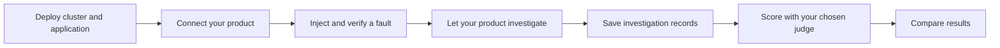

# Project Arena

A vendor-neutral starter for deploying a disposable Kubernetes fixture, injecting faults, saving investigation records from any product, and scoring completed investigations with a configurable judge. Python 3.10+ is the only Python dependency. Kubernetes operations additionally need `kubectl`; local cluster creation needs Docker and `kind`.

Choose local kind or AWS EKS for your cluster, then select the 21-scenario full suite or six-scenario smoke fixture. Cluster type and scenario suite are separate choices.

## How it works



Run commands from the Project Arena directory. Cluster setup, product integration, scenario execution, and scoring are separate steps; follow the sections below in order.

- [Benchmark results](#benchmark-results)
- [How to deploy](#how-to-deploy)
- [How to run scenarios](#how-to-run-scenarios)
- [How to connect your product](#how-to-connect-your-product)
- [How to score investigations](#how-to-score-investigations)
- [How to compare results](#how-to-compare-results)
- [How to clean up](#how-to-clean-up)
- [Advanced configuration](#advanced-configuration)

## Benchmark results

We compared **Edge Delta’s native AI investigations** with **Grafana’s native AI investigations** across 21 Kubernetes incident scenarios, including memory failures, configuration errors, storage problems, and network isolation. We measured whether each product detected the incident, then evaluated its final investigation for the correct cause, affected services, and proposed mitigation. Both products were scored against the same incident facts and rubric using GPT-6-Astra.

### Detection and investigation results

Edge Delta detected and investigated 18 scenarios; Grafana detected and investigated 12. Detection is measured out of all 21 scenarios. Investigation scores use the cases each product investigated; implementation readiness includes cases with a proposed remedy.

| Metric | Edge Delta native | Grafana native |
|:---|:---:|:---:|
| Detection | **18/21** (85.7%) | **12/21** (57.1%) |
| Root cause analysis | **15/18** (83.3%) | **9/12** (75.0%) |
| Blast radius | **12/18** (66.7%) | **8/12** (66.7%) |
| Supported final mitigation | **8/18** (44.4%) | **5/12** (41.7%) |
| Implementation readiness | **9/16** (56.2%) | **5/12** (41.7%) |

### Comparison on the same 12 incidents

This table compares investigation quality only on incidents **both products investigated**.

| Metric | Edge Delta native | Grafana native |
|:---|:---:|:---:|
| Root cause analysis | **11/12** (91.7%) | **9/12** (75.0%) |
| Blast radius | **9/12** (75.0%) | **8/12** (66.7%) |
| Supported final mitigation | **7/12** (58.3%) | **5/12** (41.7%) |
| Implementation readiness | **8/12** (66.7%) | **5/12** (41.7%) |

### What the metrics mean

| Metric | What earns credit |
|:---|:---|
| Detection | The product detected the incident and started an investigation within the observation window. |
| Root cause analysis | The final report correctly explains what caused the incident. |
| Blast radius | The final report correctly identifies the affected workloads and downstream impact, without claiming unsupported outages. |
| Supported final mitigation | The final recommendation gives a concrete, supported fix or safe containment for the incident, with no remaining incorrect or unsafe advice. |
| Implementation readiness | The proposal specifies the correction and essential details; normal review, implementation, and rollout checks may remain. |

Mitigation and readiness measure proposals, not executed repairs or verified recovery. Causal change identification had no eligible cases in these runs.

See the [scoring rubric](docs/scoring-rubric-v1.0.0.md) for grading rules and [full results and methodology](docs/benchmark-results.md) for verdict breakdowns and evaluation details.

## How to deploy

Run all commands from the Project Arena directory. Both environments use the same benchmark commands after cluster and image setup. The runner uses the context you provide; it does not automatically install networking or configure registry access.

| | Local kind | AWS EKS |
|---|---|---|
| Cluster creation | Docker and kind | Terraform in `infra/cluster` |
| Credentials | No AWS credentials | Your AWS credentials |
| Full-suite images | Build and load into kind | Build and push to a registry accessible by the nodes |
| Networking | NetworkPolicy needs an enforcing CNI | Terraform enables VPC CNI policy enforcement |
| Cleanup | Delete the kind cluster | Remove workloads, then destroy Terraform resources |

### Choose a deployment path

Cluster setup and deployment method are separate choices:

| Path | How changes reach Kubernetes | Setup |
|---|---|---|
| Direct | `bench` applies application and fault manifests with kubectl | Follow the scenario commands below |
| GitOps (full suite) | You commit and push changes to your repositories; Argo CD syncs them | Follow the [Argo CD setup and run guide](docs/gitops.md) |

The GitOps path uses component Applications, `flagd-values`, and `batch-active`. Application and fault configuration can live in separate repositories or separate paths in one repository. Use your own repositories and configure their URLs. Record which repositories the investigating product can access.

The deployment, fault, and reset commands below use the direct path. For an Argo-managed application, use the GitOps guide's commands; direct mutations are blocked to avoid conflicting with Argo's self-healing. Investigation import, scoring, and reporting work the same way for both paths.

### Local kind

Install Python 3.10+, kubectl, Docker, kind and Helm. Follow the [kind setup](infra/kind/README.md) to create a cluster with Cilium and load the full-suite images. Then select its context:

```sh
export ARENA_CONTEXT=kind-incident-bench
```

The full suite uses prebuilt application images for **Linux AMD64** and requires AMD64 workers. Apple Silicon Macs can run the smoke suite on native ARM64 kind workers, or operate an AMD64 EKS cluster. Building ARM64 fault images alone does not make the full application ARM64-compatible.

For the full suite, keep `registry: "fixture.local"` and `tag: "v1"` in `arena.json`. The linked setup enables NetworkPolicy enforcement for `netpol-isolation`. For smoke alone, `python3 -m bench cluster create` is sufficient; smoke uses a pinned public image and does not need the full-suite image build.

### AWS EKS

Install Terraform and the AWS CLI in addition to Python, kubectl and Docker. Configure your AWS credentials, then follow the [AWS cluster setup](infra/README.md) to create the cluster and kubeconfig context. Authenticate Docker to your registry and build images for your worker architecture:

```sh
export ARENA_CONTEXT=YOUR_CONTEXT
kubectl --context "$ARENA_CONTEXT" get nodes -L kubernetes.io/arch
# Choose the platform matching the workers shown above.
export ARENA_PLATFORM=linux/amd64  # Required by the full suite’s prebuilt application.
python3 -m bench.scenarios build-images --registry YOUR_REGISTRY/bench \
  --tag YOUR_TAG --platform "$ARENA_PLATFORM" --push
```

Choose the **worker architecture**, regardless of which computer runs the build:

| Kubernetes workers | Build platform |
|---|---|
| ARM64 workers | Smoke suite supported; full suite requires rebuilding and validating the application |
| Intel Mac local kind or Intel/AMD workers, including the default EKS `m6i.xlarge` | `linux/amd64` |

An Apple Silicon Mac can build for Intel/AMD EKS workers using `linux/amd64`; [Docker Desktop supports cross-platform builds through emulation](https://docs.docker.com/build/building/multi-platform/). This command builds one target architecture at a time. On mixed-architecture clusters, the application is scheduled on AMD64 workers.

Set `registry` and `tag` in `arena.json` to those same values. Nodes must have pull access to the registry; configure registry permissions or Kubernetes pull credentials yourself. AWS resources incur charges. Terraform currently creates subnets in three availability zones within one region; zone count and worker count are separate settings.

After either setup, install your product's collector and alert configuration using its instructions. Continue with the run configuration below.

## How to run scenarios

### Configure a run

```sh
python3 -m bench init
```

Edit the generated `arena.json`:

| Setting | What to enter |
|---|---|
| `context` | Your Kubernetes context from setup; no ambient-context fallback |
| `product` | Product name used in report columns |
| `run_id`, `output_dir` | A unique run name and its result directory |
| `suite`, `scenario` | `full` or `smoke`, and a scenario from that suite |
| `registry`, `tag` | Values used when building full-suite images |
| `judge` | API provider, model and optional endpoint/settings |
| `judge_command` | Optional custom judge executable; overrides the built-in API adapter |
| `truths` | Optional answer-key overrides for customized scenarios |

The default `full` suite currently includes 21 scenarios. The smaller `smoke` suite includes six and uses a public Python image, so it does not need the fault-image build. They use different applications; select a suite before deploying. See the [scenario table](docs/scenarios.md) for requirements and differences.

```sh
python3 -m bench catalog
python3 -m bench deploy
```

Before injecting a fault, complete [product setup](#how-to-connect-your-product) and confirm the product receives the healthy application's telemetry.

### Inject and observe

For the full suite:

```sh
python3 -m bench fault
python3 -m bench verify
python3 -m bench evidence
```

`fault` applies the manifests; `verify` checks whether the expected failure is observed. Successful application alone does not establish a valid test. Let the product finish investigating before resetting the fault.

For `smoke`, use `fault` and `evidence`, then inspect pod status, events and service availability yourself; automated `verify` currently supports only `full`. A healthy smoke app serves HTTP on port 8080:

```sh
kubectl --context "$ARENA_CONTEXT" -n incident-bench port-forward service/api 8080:8080
# In another terminal:
curl http://localhost:8080/health
```

For another attempt, reset first and select a fresh case directory with `--case`, placed before the command:

```sh
python3 -m bench --case oom-attempt2 fault
python3 -m bench --case oom-attempt2 verify
python3 -m bench --case oom-attempt2 evidence
```

Use that same `--case` for subsequent import and scoring commands. It selects an artifact directory, not a different scenario. Change `scenario` in the run file when testing another fault.

## How to connect your product

Install your product's collector and configure alerts using its own instructions. Project Arena does not install a vendor agent, log in to a product, or configure alerts automatically. Kubernetes logs, events, pod state and application behavior provide the fault signals; collect metrics and traces through your chosen tooling.

Set `product` in `arena.json` to the name you want in comparison tables. After the investigation, save these files under `<output_dir>/<scenario>/` (or your selected case directory):

| File | Contents |
|---|---|
| `final.txt` | The actual delivered final answer, unchanged |
| `intermediate.txt` | Earlier advice, if available |
| `actions.txt` | Tool submissions and results, if available |

Import them with:

```sh
python3 -m bench archive
```

The command uses those filenames automatically. Missing final input is an error; missing intermediate/action evidence stays missing. Record detection explicitly with `--detection detected` or `--detection not_detected` when supported by an observation window and evidence; the default is `not_measured`.

Manual export is supported. For API-based integration, provide an exporter using the [investigation record format](docs/integrations.md#investigation-records). Hosted-product connectors are not bundled. An undetected case can still have a record with an empty final answer; it must not be represented as a completed investigation.

## How to score investigations

The judge is an AI model that compares a completed investigation with the scenario's answer key and the [scoring rubric](docs/scoring-rubric-v1.0.0.md). Answer keys are included.

1. In `arena.json`, choose the judge provider and model. For example, edit the existing `judge` section:

   ```json
   "judge": {
     "provider": "openai",
     "model": "YOUR_MODEL"
   }
   ```

2. Make the provider's API key available in your shell (`OPENAI_API_KEY` for this example). Keep the key out of `arena.json`. [Other providers and local models](docs/integrations.md#judge-configuration) are supported.

3. After importing the investigation, run:

   ```sh
   python3 -m bench packet  # Prepare the investigation, answer key and scoring rules
   python3 -m bench judge   # Send them to your chosen model
   ```

The result is `judgment.json` in the case directory: scores, explanations and supporting quotes. Use the same judge model and settings for every product you compare. API calls may incur charges.

You can score the same saved investigation again without rerunning the incident. See [rescoring and saved results](docs/integrations.md#rescoring-and-saved-results) for details.

### Causal change identification

This metric asks whether the final investigation identifies the change that caused the incident and explains why. Either deployment path can support it: the scenario must supply a known introducing change, its diff, and a recorded check that the investigating product can access that history. Installing Argo CD or connecting a repository alone does not make a scenario eligible.

Only eligible cases enter this metric's denominator; the detail report lists the breakdown. See [causal change setup](docs/causal-changes.md) for the required evidence.

## How to compare results

```sh
python3 -m bench report --summary > summary.csv
python3 -m bench report --details > details.csv
```

The summary puts metrics in rows and products in columns. Each cell shows **successful/applicable (percentage)**. Illustrative values, not benchmark results:

| Metric | Product A | Product B |
|---|---:|---:|
| Detection | 8/10 (80.0%) | 7/10 (70.0%) |
| Root cause analysis | 6/8 (75.0%) | 5/7 (71.4%) |
| Causal change identification | 4/6 (66.7%) | 3/6 (50.0%) |
| Final mitigation | 5/8 (62.5%) | 4/7 (57.1%) |

The actual report includes every scoring dimension. The detail table lists each scenario's verdict and whether it is included in the denominator. Undetected cases count against detection rate; not-applicable cases are excluded from the relevant scoring denominator. Insufficient evidence stays in the denominator for applicable scored cases. Missing measurements and unscored investigations remain visible in the details. A dash means no applicable scored cases.

Product names come from investigation records, matched to judgments by content hash. Records and judgments are discovered in the configured run directory. Include records for undetected cases too. Use matching scenario cohorts, rubric and judge settings when comparing products; see [report options and counting rules](docs/reporting.md) for combining runs and interpreting each metric.

## How to clean up

### Reset between scenarios

For GitOps, follow the [Git reset and sync workflow](docs/gitops.md) so the repository and cluster return to the same baseline.

For the full suite using direct deployment:

```sh
python3 -m bench reset --confirm-disposable
```

This retires the injected resources, restores the three scenario flags, and clears only that fault’s persistent effects. Healthy services, application data, credentials and the cluster remain in place; reset verifies the baseline before another fault. For `smoke`, use `python3 -m bench reset`; it restores the app but retains the storage fault's PVC.

### Remove a local kind cluster

```sh
python3 -m bench cluster delete --confirm-delete
```

### Remove AWS resources

Remove application resources and any provisioned volumes or load balancers, then follow the [AWS teardown instructions](infra/README.md#workloads-and-teardown). Resetting a fault does not stop AWS charges. Optional Terraform state storage persists separately.

## Advanced configuration

- Use `--run path/to/run.json` before a command to select another configuration. Explicit flags override saved settings.
- Configured file paths are relative to the run file. Explicit CLI paths and judge executable arguments are relative to the current working directory.
- Use `packet --rubric path/to/rubric.md` for a custom rubric. Keep the same rubric and judge settings across compared products.
- [Product exporters and judge formats](docs/integrations.md) describe custom integrations and evidence requirements.
- [Causal change setup](docs/causal-changes.md) explains the repository history, deployment evidence and access checks required for that metric.
- [Scenario implementation guide](scenarios/README.md) covers manifests, image builds, verification and reset behavior.

To run the offline tests:

```sh
python3 -m unittest discover -s tests -v
```
