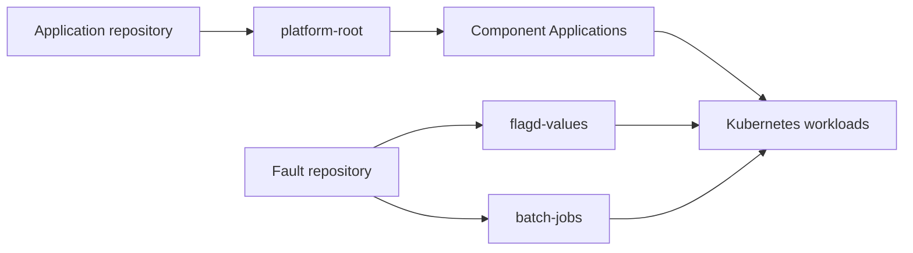

# Run scenarios through Argo CD

The direct runner applies manifests with kubectl. This optional path preserves Git-driven deployment: a commit changes the desired state, Argo CD applies it, and the investigation can inspect the resulting application and sync history.



Use separate application and fault repositories to control which change history a product can see. They may also share a repository with separate paths. Giving a product access to the fault repository changes the evidence available to its investigation; record that choice. Installing Argo does not automatically make causal-change identification eligible: the scenario still needs a reviewed introducing commit and recorded product access.

## Configure your repositories

Clone your own repositories locally. Add this object to `arena.json`; paths are relative to that file. The run's existing `context`, `registry`, `tag`, `scenario`, and `output_dir` settings are reused.

```json
{
  "gitops": {
    "app_repo": {
      "url": "https://github.com/YOUR_ORG/service-manifests.git",
      "checkout": "../service-manifests",
      "revision": "main",
      "path": "arena-apps"
    },
    "fault_repo": {
      "url": "https://github.com/YOUR_ORG/platform-config.git",
      "checkout": "../platform-config",
      "revision": "main",
      "path": "arena-faults"
    }
  }
}
```

Set a repository’s `path` to `.` to use the original root-level `apps/`, `components/`, `batch-active/` and `flagd-values/` layout in separate empty repositories; prefixes are optional. Export refuses to overwrite an existing unmanaged tree.

The tools never create a hosted repository, commit, or push. Use your normal Git authentication. Argo independently needs read access to both repositories; configure that in Argo's repository settings. Keep credentials out of repository URLs and run settings. Public repositories need no repository credential.

## Install Argo and export the desired state

Use a dedicated cluster with the [full-suite prerequisites](../scenarios/README.md), including AMD64 workers and a default StorageClass. Install the pinned [Argo CD chart 10.4.0](https://github.com/argoproj/argo-helm/releases/tag/argo-cd-10.4.0):

```sh
helm repo add argo https://argoproj.github.io/argo-helm
helm repo update argo
helm upgrade --install argo-cd argo/argo-cd --version 10.4.0 \
  --namespace argocd --create-namespace --kube-context YOUR_CONTEXT --wait
python3 -m bench.gitops export
```

Export creates:

| Application repository | Fault repository |
|---|---|
| `apps/`: child Application definitions | `library/`: rendered fault manifests |
| `components/`: shop, database and collector manifests | `batch-active/`: initially empty workload selection |
| | `flagd-values/`: healthy feature flags |
| | `control/`: run state used by verification |

Generated files go inside the configured repository paths. Review them, then commit and push each checkout with your normal Git workflow. For example:

```sh
git -C ../service-manifests add arena-apps
git -C ../service-manifests commit -m "Add benchmark application"
git -C ../service-manifests push origin main
git -C ../platform-config add arena-faults
git -C ../platform-config commit -m "Add benchmark fault definitions"
git -C ../platform-config push origin main
python3 -m bench.gitops bootstrap
python3 -m bench.gitops sync
```

Bootstrap creates the owned namespaces, generates database credentials directly in Kubernetes, and applies `platform-root`. It does not write generated credentials into either repository. `platform-root` creates the component Applications and the separate `flagd-values`, `batch-jobs`, and `arena-control` Applications. They use automatic sync, pruning and self-healing. Only `batch-jobs` permits an empty application; component apps retain the parent’s `CreateNamespace=true` setting.

`sync` checks that Argo reports the exact committed checkout revisions, then checks the runtime result. Local uncommitted changes cause refusal. A failed workload can correctly be `Synced` and `Degraded` during an injected fault, so sync verification does not mistake the fault's unhealthy status for a deployment mismatch.

Do not place Argo over an active direct deployment. Finish direct tests and remove their disposable fixture namespaces first, or use another cluster. Once Argo owns the fixture, the direct deploy/fault/reset commands refuse to modify it, preventing self-healing from undoing those changes.

## Inject and reset

Set `scenario` in `arena.json`, then prepare the change locally. The fault command first checks that the deployed Applications and parent retirement invariants are healthy; it refuses to stack another fault on an incomplete reset:

```sh
python3 -m bench.gitops fault
git -C ../platform-config diff -- arena-faults
git -C ../platform-config add arena-faults
git -C ../platform-config commit -m "Enable benchmark workload"
git -C ../platform-config push origin main
python3 -m bench.gitops sync
```

Flag scenarios change only their selected default variant in `flagd-values`; workload scenarios select a library directory in `batch-active` without rewriting unrelated flags. For quota and admission-webhook faults, `sync` deletes exactly one recommendation pod after the fault revision is applied. A Kubernetes operation receipt prevents repeat deletion on later syncs. If deletion was interrupted or failed, the receipt stays explicitly uncertain: inspect the recorded pod before resolving that operation; the runner will not silently delete a replacement.

Reset has the same explicit Git step:

```sh
python3 -m bench.gitops reset
git -C ../platform-config add arena-faults
git -C ../platform-config commit -m "Retire benchmark workload"
git -C ../platform-config push origin main
python3 -m bench.gitops sync
```

Argo prunes the fault workloads and restores the three scenario flags, preserving other flag settings. The recorded retired scenario selects its cleanup: Redis pressure restores the 256mb budget before removing only `warm:*` keys; stale credentials restore the password from the actual catalog Deployment setting or referenced Secret; a held catalog lock is released only after its injector disappears; a retained `index-store` PV is removed after its claim. Other cases do not mutate Redis or database credentials, and no healthy application pods are restarted.

Both paths check the parent retirement invariants, including no leftover workload/claim/policy/quota/webhook/PV, baseline flags, Redis budget/keyspace, exclusive locks and trailing two-minute authentication errors. Argo baseline/reset additionally requires every expected Application to be Synced and Healthy. Initial healthy sync runs checks without data repairs. GitOps cleanup receipts prevent repeating completed repairs on every subsequent sync. Quota and admission-webhook resets allow up to 20 minutes for the ReplicaSet controller to retry failed pod creation and for the replacement to start; other baseline waits remain three minutes. A wait timeout means recovery has not yet been confirmed. No extra restart or forced reconciliation is performed. Complete reset before preparing another fault; services, persistent stores and credentials are preserved.


Receipts under `output_dir/gitops/` record preparation/bootstrap/sync, expected Git commits, Argo's applied revisions, operation completion timestamps and health, and runtime verification. Preparation timestamps describe local preparation, not when Kubernetes applied the change. Exact SHA matching is stricter than the parent helper’s relevant-path tree comparison. These deployment records remain separate from the product's investigation and scores. Use `bench evidence` for a broader Kubernetes/Argo snapshot.
