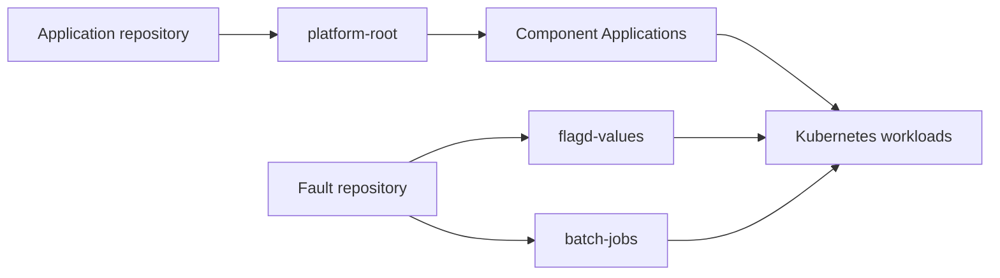

# Run scenarios through Argo CD

The direct runner applies manifests with kubectl. This optional path preserves Git-driven deployment: a commit changes the desired state, Argo CD applies it, and the investigation can inspect the resulting application and sync history.



Use separate application and fault repositories to control which change history a product can see. They may also share a repository with separate paths. Giving a product access to the fault repository changes the evidence available to its investigation; record that choice. Installing Argo does not automatically make causal-change identification eligible: the scenario still needs a reviewed introducing commit and recorded product access.

## Configure your repositories

Clone your own repositories locally. Add this object to `arena.json`; paths are relative to that file. The run's existing `context`, `registry`, `tag`, `scenario`, and `output_dir` settings are reused.

```json
{
  "gitops": {
    "app_repo": {
      "url": "https://github.com/YOUR_ORG/service-manifests.git",
      "checkout": "../service-manifests",
      "revision": "main",
      "path": "arena-apps"
    },
    "fault_repo": {
      "url": "https://github.com/YOUR_ORG/platform-config.git",
      "checkout": "../platform-config",
      "revision": "main",
      "path": "arena-faults"
    }
  }
}
```

The tools never create a hosted repository, commit, or push. Use your normal Git authentication. Argo independently needs read access to both repositories; configure that in Argo's repository settings. Keep credentials out of repository URLs and run settings. Public repositories need no repository credential.

## Install Argo and export the desired state

Use a dedicated cluster with the [full-suite prerequisites](../scenarios/README.md), including AMD64 workers and a default StorageClass. Install the pinned [Argo CD chart 10.4.0](https://github.com/argoproj/argo-helm/releases/tag/argo-cd-10.4.0):

```sh
helm repo add argo https://argoproj.github.io/argo-helm
helm repo update argo
helm upgrade --install argo-cd argo/argo-cd --version 10.4.0 \
  --namespace argocd --create-namespace --kube-context YOUR_CONTEXT --wait
python3 -m bench.gitops export
```

Export creates:

| Application repository | Fault repository |
|---|---|
| `apps/`: child Application definitions | `library/`: rendered fault manifests |
| `components/`: shop, database and collector manifests | `batch-active/`: initially empty workload selection |
| | `flagd-values/`: healthy feature flags |
| | `control/`: run state used by verification |

Generated files go inside the configured repository paths. Review them, then commit and push each checkout with your normal Git workflow. For example:

```sh
git -C ../service-manifests add arena-apps
git -C ../service-manifests commit -m "Add benchmark application"
git -C ../service-manifests push origin main
git -C ../platform-config add arena-faults
git -C ../platform-config commit -m "Add benchmark fault definitions"
git -C ../platform-config push origin main
python3 -m bench.gitops bootstrap
python3 -m bench.gitops sync
```

Bootstrap creates the owned namespaces, generates database credentials directly in Kubernetes, and applies `platform-root`. It does not write generated credentials into either repository. `platform-root` creates the component Applications and the separate `flagd-values`, `batch-jobs`, and `arena-control` Applications. They use automatic sync, pruning and self-healing.

`sync` checks that Argo reports the exact committed checkout revisions, then checks the runtime result. Local uncommitted changes cause refusal. A failed workload can correctly be `Synced` and `Degraded` during an injected fault, so sync verification does not mistake the fault's unhealthy status for a deployment mismatch.

Do not place Argo over an active direct deployment. Finish direct tests and remove their disposable fixture namespaces first, or use another cluster. Once Argo owns the fixture, the direct deploy/fault/reset commands refuse to modify it, preventing self-healing from undoing those changes.

## Inject and reset

Set `scenario` in `arena.json`, then prepare the change locally:

```sh
python3 -m bench.gitops fault
git -C ../platform-config diff -- arena-faults
git -C ../platform-config add arena-faults
git -C ../platform-config commit -m "Enable benchmark workload"
git -C ../platform-config push origin main
python3 -m bench.gitops sync
```

Flag scenarios change `flagd-values`; workload scenarios select a library directory in `batch-active`. For quota and admission-webhook faults, `sync` recreates the recommendation pod after the fault revision is applied, exposing the admission failure.

Reset has the same explicit Git step:

```sh
python3 -m bench.gitops reset
git -C ../platform-config add arena-faults
git -C ../platform-config commit -m "Retire benchmark workload"
git -C ../platform-config push origin main
python3 -m bench.gitops sync
```

Argo prunes the fault workloads and restores baseline flags. After injector pods/jobs disappear, `sync` removes only the warmer's disposable Redis keys, restores Redis's memory budget, restores the application database password, releases any remaining identified maintenance lock and refreshes catalog connections. It then checks healthy frontend/catalog responses. Complete this reset before preparing another fault; GitOps reset preserves the application and its persistent stores.

Receipts under `output_dir/gitops/` record preparation/bootstrap/sync, expected Git commits, Argo's applied revisions and health, and runtime verification. These deployment records remain separate from the product's investigation and scores. Use `bench evidence` for a broader Kubernetes/Argo snapshot.
