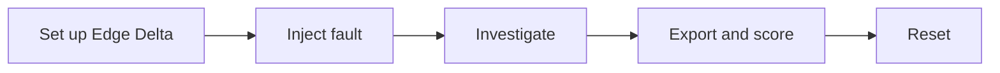

# Edge Delta integration

Use Edge Delta to investigate a benchmark incident, then download the completed investigation for scoring. This directory is excluded from Git while the integration is under review.

The exporter uses `edx` for read-only thread requests. It takes your profile, organization and channel from a local configuration file. Other products can use the benchmark without installing edx or providing Edge Delta credentials.

## Flow



The benchmark CLI handles deployment, fault injection, verification, scoring and reset. The exporter below handles capture and conversion. Configure Edge Delta's telemetry, connectors, monitors and teammate permissions in your own organization before the run. Automatic product setup, thread discovery and waiting for completion are not implemented here.

## Prepare Edge Delta

1. Create an organization manually in the [Edge Delta web app](https://app.edgedelta.com/), or ask an administrator to invite you to an existing one. This integration does not create organizations. Then authenticate with `edx` as described below.
2. Connect the benchmark cluster to Edge Delta and verify that logs, events and metrics arrive. Give investigation tools the evidence access required by the chosen scenarios.
3. Configure monitors to send incident notifications to your chosen AI channel. Check that the notifications actually trigger investigations.
4. Record monitor definitions, teammate instructions/models, connector permissions, and memory settings used for the comparison. Keep scheduled loops paused for an alert-only trial; a loop-enabled trial is a separate configuration.
5. Verify a healthy benchmark baseline before injecting a fault.

An API token is not stored in this integration's configuration. The selected edx profile supplies authentication. Environment credential overrides are cleared for exporter requests so they cannot silently select a different account.

## Install edx

On macOS or Linux with Homebrew:

```sh
brew install edgedelta/tap/edx
edx version
```

Alternatively, with Go installed:

```sh
go install github.com/edgedelta/edx@latest
```

Make sure Go's binary directory is on your `PATH`. See the [edx installation guide](https://docs.edgedelta.com/edx-cli/) for details.

## Set up an edx profile

Create a named profile using browser sign-in. Production is the default; no environment flag is needed:

```sh
edx auth login --profile project-arena
```

Complete sign-in in the browser using the account and organization you want to test. The profile name is a local label; it does not create an Edge Delta organization. OAuth determines the organization associated with the login.

Check the saved profile and its organization:

```sh
edx auth list
edx --profile project-arena auth status
edx --profile project-arena config show
```

`config show` masks credentials. Copy its organization ID into the exporter's `org` setting, and set `profile` to `project-arena`. If it shows the wrong organization, correct the browser sign-in and repeat login with `--force` to replace this profile:

```sh
edx auth login --profile project-arena --force
```

On a machine without a local browser, add `--device` to the login command. Credentials are stored by edx in `~/.config/edx/config.yaml`; OAuth tokens refresh automatically. You do not need to edit that file or copy tokens into the benchmark.

Optionally run `edx auth use project-arena` to make it your default for interactive commands. The exporter always uses the profile named in its own configuration.

### Login and password help

If you signed up through an emailed magic link, use the same email when the browser opens. Choose **Use a magic link** if that option is shown; you do not need to invent a password.

To set or reset a password:

1. Open the Edge Delta sign-in page. If needed, choose **Use a password** to reveal **Forgot password?**
2. Click **Forgot password?**, enter your account email, and click **Reset via email**.
3. Open the email and follow the link to set your password.
4. Return to the browser login opened by `edx`, or restart `edx auth login --profile project-arena`. Add `--force` only when replacing an existing saved profile.

For an organization that requires SSO, use its SSO sign-in. A password reset does not add you to an organization; ask its administrator for membership if the intended organization is missing.


## Configure the exporter

Run these commands from the project root:

```sh
cp products/edgedelta/config.example.json products/edgedelta/local.json
```

Edit `local.json`:

```json
{
  "profile": "YOUR_EDX_PROFILE",
  "org": "YOUR_ORG_ID",
  "channel": "YOUR_CHANNEL_ID"
}
```

Set the benchmark scenario, run ID and output directory in `arena.json` as described in the [main README](../../README.md). The exported product name is `Edge Delta`.

## Capture a completed investigation

Find its thread ID in Edge Delta or list threads using your configured account:

```sh
edx --profile YOUR_EDX_PROFILE --org YOUR_ORG_ID \
  ai threads list --channel YOUR_CHANNEL_ID --all -o json
```

Choose the thread corresponding to your incident and run:

```sh
python3 products/edgedelta/export.py capture THREAD_ID \
  --out runs/demo/oom/edgedelta-capture
```

The command prints message IDs, senders, states and text lengths. It saves:

| File | Contents |
|---|---|
| `thread.json` | Original thread response |
| `messages.json` | Original response containing all fetched message pages |
| `capture.json` | Thread/account identifiers, capture time and message-file hash |

The capture records what the API returned at that time. Later thread updates do not change saved files; capture again in a new directory if you want to score an updated investigation.

Files are private and never overwritten. Captured messages and tool results are not shortened. The capture cannot recover content the API itself omits.

## Select the final report and export

Review the completed thread and choose the message containing the final report delivered to the user:

```sh
python3 products/edgedelta/export.py export \
  --capture runs/demo/oom/edgedelta-capture \
  --final-message FINAL_MESSAGE_ID \
  --out runs/demo/oom/archive.json
```

The exporter requires a completed orchestrator answer. It rejects alerts, delegations, unfinished messages and an answer followed by more investigation. It records the selected message ID and keeps earlier agent messages separate. If the API uses a different message schema, the exporter stops rather than guessing.

The output is the standard `archive-v1` investigation record. It contains the final answer, earlier agent prose, and tool/approval records with their message IDs. No action records means missing evidence, not proof that no unsafe action occurred. Detection remains `not_measured`: selecting a thread does not establish that detection happened inside the benchmark's observation window.

Review captured content for credentials or other sensitive data before sending it to a judge or sharing it. The saved API responses are unchanged; this exporter does not claim to sanitize arbitrary tool output.

## Score and report

Once `archive.json` is in the configured case directory:

```sh
python3 -m bench packet
python3 -m bench judge
python3 -m bench report --summary > summary.csv
python3 -m bench report --details > details.csv
```

This uses the same answer keys and judge as other integrations. Judge configuration is independent of edx authentication. See [scoring setup](../../README.md#how-to-score-investigations).

## Reset

```sh
python3 -m bench reset --confirm-disposable
```

Reset restores the benchmark application; it does not stop Edge Delta investigations or snooze monitors. Snooze the benchmark monitors before tearing down the cluster to avoid investigations triggered by teardown events.

## Check the exporter locally

```sh
python3 -m unittest discover -s products/edgedelta -p 'test_*.py'
```

These tests use saved-response examples and do not contact Edge Delta.
