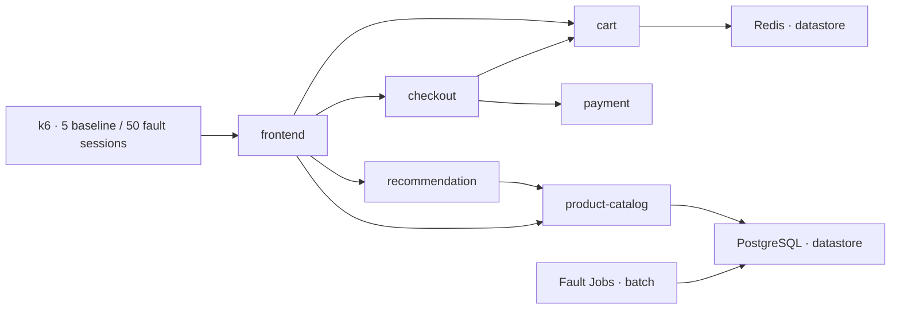

# Benchmark scenarios

The full suite includes fault manifests, container build contexts, and an application with shop services, PostgreSQL and Redis.

## Directory layout

```text
scenarios/
├── shop/                  # Pinned application manifests, flags, and build recipe
├── dependencies/          # Supporting service manifests
├── faults/
│   ├── oom/
│   │   ├── Dockerfile
│   │   ├── run.sh         # Fault-producing program
│   │   ├── answer-key.json # Judge-only cause, impact, and mitigation
│   │   └── manifests/    # Kubernetes deployment and kustomization
│   └── ...
└── scenarios.json         # Scenario paths, image names and requirements
```

Each fault keeps its program beside its `manifests/` directory. Configuration-only faults use the shared shop application and do not need their own Dockerfile. Composite scenarios reference other faults' manifests instead of copying their programs. Image names in `scenarios.json` preserve the names referenced by the deployments.

## Topology



The bundled application preserves the original shop services, including currency, ad, shipping, quote, Kafka and flagd. Payment rejects charge tokens when `paymentStrictTokenCheck` is enabled. Cart routes operations to an unavailable secondary store when `cartSecondaryStoreShare` is enabled. Product-catalog reads PostgreSQL; recommendation and frontend call product-catalog. The database faults therefore propagate through that dependency chain.

The original resource requests and selectors are preserved. Recommendation has no CPU request or limit; quota injection recreates its pod to trigger admission failure. Other workloads without CPU requests are also exposed if recreated while the quota is present. The unavailable admission webhook is scoped to `shop`.

## Build

Requirements: Python3.10+, kubectl, Docker; kind for local clusters. Choose [local kind or AWS EKS](../README.md#how-to-deploy) first. AWS cluster creation is documented in the [infrastructure guide](../infra/README.md).

```sh
# Create the cluster using infra/kind/README.md first.
python3 -m bench.scenarios build-images --kind-name incident-bench
```

The original prebuilt shop images support **Linux AMD64 only**. Run the full suite on AMD64 workers. Apple Silicon can run the separate smoke suite natively; an ARM64 full-suite build requires rebuilding the shop from `shop/build.sh`, replacing its image pins, and validating it. Fault images themselves can be built for either architecture. Select the worker architecture, not the laptop architecture.

This builds 13 fault images, then loads them into the named kind cluster. No push occurs. To use a cloud registry, authenticate using your own tooling and explicitly request publication:

```sh
# Original full-suite application images require AMD64 workers.
export ARENA_PLATFORM=linux/amd64
python3 -m bench.scenarios build-images --registry YOUR_REGISTRY/bench \
  --tag YOUR_TAG --platform "$ARENA_PLATFORM" --push
```

Do not create `asset-syncer:missing-hotfix`: the missing tag is the image-pull fault. The application uses pinned public images from `shop/images.json`; `shop/manifests.json` bundles its Kubernetes objects. Deployment does not clone any repository or require registry credentials for these public images. `shop/build.sh` reproduces the application modifications from the pinned public OpenTelemetry source revision. Review it before publishing rebuilt images to your own registry.

Use unique tags for locally built fault images and reuse the same images across products. Operation evidence records deployed image IDs. The historical PostgreSQL, Redis and BusyBox references were mutable tags; the bundled references now pin their currently resolved digests, so historical binary identity is not asserted.

## Deploy, inject, verify, reset

```sh
python3 -m bench.scenarios deploy --context kind-incident-bench
python3 -m bench.scenarios start payment-failure --context kind-incident-bench
python3 -m bench.scenarios verify payment-failure --context kind-incident-bench --timeout 180
python3 -m bench.scenarios reset --context kind-incident-bench --confirm-disposable
```

For cloud deployment pass `--registry` and `--tag` to deploy. The controller remembers them for subsequent injections. Every Kubernetes action needs an explicit context; no personal profile or vendor credential is used. Existing namespaces without the fixture ownership label are rejected. The owned namespaces are `benchmark-control`, `shop`, `datastore`, `batch`, `platform-ops`, `telemetry`.

Deploy generates separate random administrator/application passwords, supplies them to Kubernetes over stdin, waits for readiness and checks frontend and catalog responses. It records reset state before workload application, allowing cleanup after partial deployment. Secrets are not printed or saved into tracked files.

Start accepts only one active scenario. Applying YAML is reported separately from observing a fault. Verify polls Kubernetes status/events, application responses, or logs; it exits nonzero if the expected mechanism is not observed. For the PostgreSQL lock scenario, a generic timeout is insufficient: verification also requires a granted exclusive lock on `catalog.products`. Multi-fault requires both crashloop and Redis-write rejection signals. Traffic confirmation checks that the load-generator adopted 50 concurrent sessions; this is not a measurement of achieved request throughput.

**Reset deletes and recreates the owned fixture namespaces and their disposable data**, then creates fresh credentials and checks the healthy path. This removes database credential changes, locks, Redis keys/configuration, stale jobs and lingering flags. It first removes the owned webhook, then namespaces, then the owned disposable PV. Unowned cluster-scoped resources with conflicting names cause refusal. This command is for a dedicated disposable fixture, not a production/shared namespace. The confirmation flag makes the data replacement explicit.

## Environment requirements

- `netpol-isolation` requires a NetworkPolicy-enforcing CNI. The EKS configuration enables VPC CNI policy enforcement. Default kind networking does not enforce policies; install an enforcing CNI before this scenario. Verification will otherwise report not observed.
- `pending-volume-claim` requires its requested StorageClass to be absent.
- `volume-affinity-conflict` requires no matching `storage-tier=nvme-archive` node; it creates a cluster-scoped disposable PV.
- ConfigMap-backed flags can take time to propagate. Use an observation window that includes projection delay.
- Slow-leak verification requires at least two growth observations; allow more than one minute after startup.
- Traffic uses the original k6 browse/checkout journeys: 5 baseline sessions, 50 under the traffic fault. Achieved requests per second depend on response latency.
- Readiness/liveness distinguish process health from the business request path; workload readiness alone does not establish recovery. The controller also checks frontend business responses.

## Application telemetry

The bundled neutral collector listens at `otel-collector.telemetry.svc.cluster.local:4317` (gRPC) and `:4318` (HTTP), matching the application's OTLP settings. Its default debug exporter writes received spans, metrics and logs to the collector's Kubernetes logs. This proves reception but is not a durable telemetry store.

Before a product run, edit `shop/collector.yaml` to add that product's authorized exporter and include it in each relevant pipeline, then deploy. For an already deployed cluster, update the `telemetry/otel-collector` ConfigMap and restart its Deployment. Keep secrets outside the tracked configuration. Products must also collect Kubernetes workload logs/events using their own supported integration; OTLP application data alone does not cover every fault.

## Render for review

```sh
python3 -m bench.scenarios catalog
python3 -m bench.scenarios render multi-fault --registry YOUR_REGISTRY/bench --tag YOUR_TAG > /tmp/multi-fault.yaml
```

Rendering is local and does not query the cluster. Low-level manual application remains possible, but use deploy/start/reset to obtain ownership checks, generated credentials and complete cleanup. The Redis-only dependency file is retained as a minimal standalone component; the complete deploy command creates an owned Redis plus live application consumer.

## Scoring

```sh
python3 -m bench archive --suite full --scenario oom --run-id example --case-id oom-1 \
  --product YOUR_PRODUCT --final final.txt --out archive.json
python3 -m bench packet --archive archive.json \
  --out packet.json
```

Each scenario includes an `answer-key.json` matched to its program, manifests and shop dependencies. The scorer loads it automatically. Use `--truth` for a customized scenario. Keys are judge-only and separately hashed; keep them out of the investigated product’s evidence sources.

The default [scoring rubric](../docs/scoring-rubric-v1.0.0.md) covers diagnosis, final mitigation, implementation readiness, action safety and intermediate advice. Product exporters, manual import, external AI judges and manual judges remain fully replaceable; no Edge Delta credentials are required.
